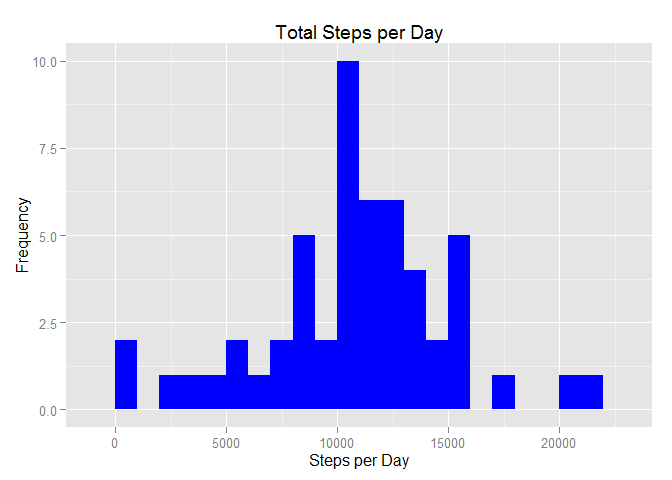
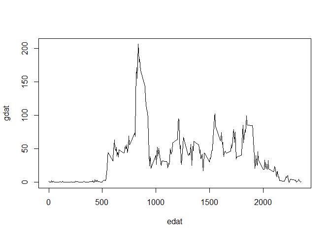
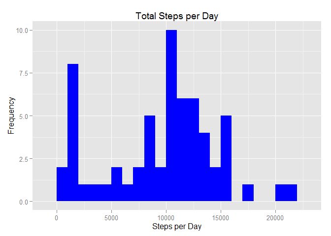
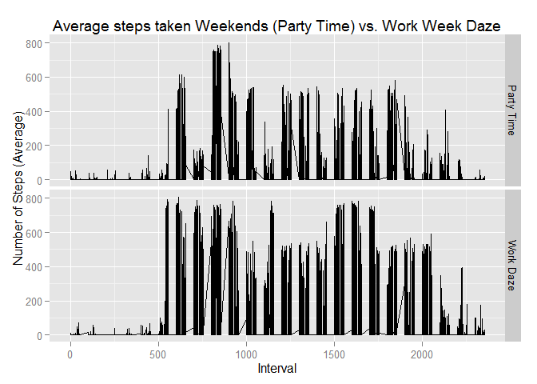

# Reproducible Research Assignment 1
armistead  
August 6, 2017  


```r
library(dplyr)
```

```
## 
## Attaching package: 'dplyr'
```

```
## The following objects are masked from 'package:stats':
## 
##     filter, lag
```

```
## The following objects are masked from 'package:base':
## 
##     intersect, setdiff, setequal, union
```

```r
library(ggplot2)
library(lubridate)
```

```
## 
## Attaching package: 'lubridate'
```

```
## The following object is masked from 'package:base':
## 
##     date
```

Loading and preprocessing the data


```r
setwd("C:/Users/johnarmistead/Data Sci Coursera/Class5")
raw <- read.csv("activity.csv", header=TRUE, sep=",", colClasses = c("numeric", "character", "integer"))
data <- as.data.frame(raw)
data$date <- ymd(data$date)
```

What is mean total number of steps taken per day?
For this part of the assignment, you can ignore the missing values in the dataset.


```r
cdat <- data %>%
        filter(!is.na(steps)) %>%
        group_by(date) %>%
        summarise(steps=sum(steps))

a <- mean(cdat$steps) #mean steps per day
b <- median(cdat$steps) #median steps per day
cat("Mean without NAs:", a)
```

```
## Mean without NAs: 10766.19
```

```r
cat("Median without NAs:", b)
```

```
## Median without NAs: 10765
```

Create a plot to visualize mean total steps per day without missing values.


```r
plot1 <- ggplot(cdat, aes(x=steps))+
        geom_histogram(fill="blue", binwidth=1000)+
        labs(title="Total Steps per Day", x="Steps per Day", y="Frequency")

print(plot1)
```

<!-- -->


What is the average daily activity pattern?
Make a time series plot (i.e. type = "l") of the 5-minute interval (x-axis) and the average number of steps taken, averaged across all days (y-axis).


```r
ddat <- data %>%
        select(steps, date, interval) %>%
        filter(!is.na(steps))

edat <- unique(ddat$interval)
fdat <- split(ddat$steps, ddat$interval)
gdat <- sapply(fdat, mean, na.rm=TRUE)
plot2 <- plot(edat, gdat, type="l")
```

<!-- -->

```r
print(plot2)
```

```
## NULL
```

Which 5-minute interval, on average across all the days in the dataset, contains the maximum number of steps?


```r
m <- gdat[which.max(gdat)] #find max
cat("Interval of and # Max number of steps:")
```

```
## Interval of and # Max number of steps:
```

```r
print(m)
```

```
##      835 
## 206.1698
```

Imputing missing values
Note that there are a number of days/intervals where there are missing values (coded as NA). The presence of missing days may introduce bias into some calculations or summaries of the data.

Calculate and report the total number of missing values in the dataset (i.e. the total number of rows with NAs)


```r
sum(is.na(data$steps))
```

```
## [1] 2304
```

Devise a strategy for filling in all of the missing values in the dataset. The strategy does not need to be sophisticated. For example, you could use the mean/median for that day, or the mean for that 5-minute interval, etc.
Create a new dataset that is equal to the original dataset but with the missing data filled in.

We'll do this using tapply but watch out for character formatting with this one


```r
fulldat <- data #start clean df
nodat <- is.na(fulldat$steps) #looks at NAs only
med <- tapply(fulldat$steps, fulldat$interval, median, na.rm=TRUE, simplify=TRUE) #plug median in for NA values
fulldat$steps[nodat] <- med[as.character(fulldat$interval[nodat])] #connect tables together
head(fulldat)
```

```
##   steps       date interval
## 1     0 2012-10-01        0
## 2     0 2012-10-01        5
## 3     0 2012-10-01       10
## 4     0 2012-10-01       15
## 5     0 2012-10-01       20
## 6     0 2012-10-01       25
```


Group imputed table by date

```r
fullsteps <- fulldat %>%
     group_by(date) %>%
     summarise(steps=sum(steps))
head(fullsteps)
```

```
## Source: local data frame [6 x 2]
## 
##         date steps
##       (date) (dbl)
## 1 2012-10-01  1141
## 2 2012-10-02   126
## 3 2012-10-03 11352
## 4 2012-10-04 12116
## 5 2012-10-05 13294
## 6 2012-10-06 15420
```

Make a histogram of the total number of steps taken each day and Calculate and report the mean and median total number of steps taken per day.
Do these values differ from the estimates from the first part of the assignment?
Create a histogram of the new total steps per day with imputed values.


```r
ggplot(fullsteps, aes(x=steps))+
        geom_histogram(fill="blue", binwidth=1000)+
        labs(title="Total Steps per Day", x="Steps per Day", y="Frequency")
```

<!-- -->

```r
j <- mean(fullsteps$steps) #mean steps per day
k <- median(fullsteps$steps) #median steps per day
cat("New imputed mean steps per day:", j)
```

```
## New imputed mean steps per day: 9503.869
```

```r
cat("New imputed median steps per day:", k)
```

```
## New imputed median steps per day: 10395
```

```r
cat("Since we imputed the median in for NAs the old median ", print(b), " now equals the median", print(k))
```

```
## [1] 10765
## [1] 10395
## Since we imputed the median in for NAs the old median  10765  now equals the median 10395
```

What is the impact of imputing missing data on the estimates of the total daily number of steps?


```r
x <- sum(cdat$steps)
y <- sum(fullsteps$steps)
z <- y-x
cat("Total impact of imputing median into NA:", z)
```

```
## Total impact of imputing median into NA: 9128
```

Are there differences in activity patterns between weekdays and weekends?
For this part the weekdays() function may be of some help here. Use the dataset with the filled-in missing values for this part.


```r
newdat <- fulldat
```

Create a new factor variable in the dataset with two levels - "weekday" and "weekend" indicating whether a given date is a weekday or weekend day.


```r
newdat <- mutate(newdat, period=ifelse(weekdays(newdat$date)=="Saturday" | weekdays(newdat$date)=="Sunday", "Party Time", "Work Daze"))
```

Make a panel plot containing a time series plot (i.e. type = "l") of the 5-minute interval (x-axis) and the average number of steps taken, averaged across all weekday days or weekend days (y-axis). See the README file in the GitHub repository to see an example of what this plot should look like using simulated data.


```r
qplot(newdat$interval, newdat$steps, data=newdat,
       type="l",
       geom="line",
       xlab="Interval",
       ylab="Number of Steps (Average)",
       main="Average steps taken Weekends (Party Time) vs. Work Week Daze",
       facets =period ~ .)
```

<!-- -->
